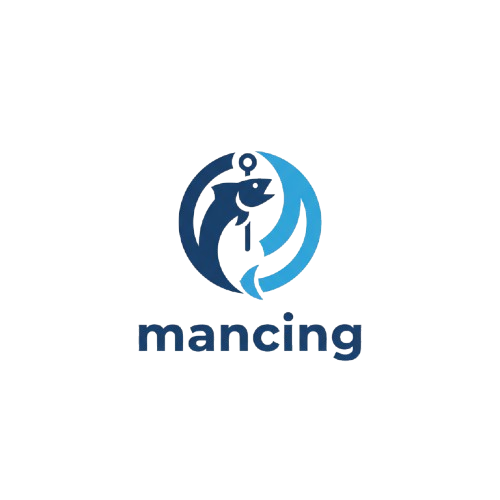

### 🎣 Mancing Tools

Macro Mancing di indovoice

* Forever free and fully open-source
* Feature-rich with automation and auto-update system
* Modern GUI with real-time debug window

made with ❤️ by lamont

[](https://github.com/athuridha/mancing-tools/releases/latest)
[](https://github.com/athuridha/mancing-tools/releases/latest)


## ⭐ Features

Mancing Tools was developed with a primary focus on achieving accuracy during fishing minigames. It has since expanded to include several powerful features:

* **Advanced Color Detection**: HSV-based green bar detection with customizable thresholds for precise timing.
* **Auto-Update System**: Automatically checks for updates and provides one-click installation from GitHub releases.
* **Modern UI**: Sleek dark-themed interface with scrollable pages and responsive layouts.
* **Press-to-Bind Keybinds**: Intuitive hotkey setup by simply pressing the desired key.
* **ROI Calibration Tools**: Multiple methods including drag-select with auto-minimize for clear screen view.
* **Real-time Debug Window**: OpenCV-powered visual overlay showing detection zones and color ratios.
* **Preset System**: Save and load configurations with JSON-based settings management.
* **Auto Recast**: Intelligent automatic rod casting after minigame completion.

and much more!

##  Installation

## 📦 Installation

### 1. Quick Start (Recommended)
Download the compiled executable (.exe) from the [releases page](https://github.com/athuridha/mancing-tools/releases/latest) - no Python installation required.

> [!WARNING]
> **⚠️ Antivirus False Positive Detection**
> 
> Some antivirus programs may flag the compiled executable as malicious. **These are FALSE POSITIVES.**
> 
> **Why this happens:**
> - PyInstaller bundling triggers heuristic detection
> - Automation features (keyboard, mouse) flagged as "keylogger behavior"
> - Windows API calls for auto-pause system
> - Unsigned executable (code signing costs $300-500/year)
> 
> **You can verify safety by:**
> - ✅ Reading the [full source code](https://github.com/athuridha/mancing-tools) (100% open source)
> - ✅ Building from source yourself (see instructions below)
> - ✅ Scanning with [VirusTotal](https://www.virustotal.com) (expect 2-5 generic flags from 70+ scanners)
> - ✅ Reading our [False Positive Info](FALSE_POSITIVE_INFO.md) for technical details
> 
> **To allow execution:**
> - Windows Defender: Click "More info" → "Run anyway"
> - Or add exclusion: Windows Security → Virus & threat protection → Exclusions → Add folder
> 
> **Don't trust us?** Build it yourself! All steps below are transparent. 🔒

### 2. Run from Source
```bash
git clone https://github.com/athuridha/mancing-tools
cd mancing-tools
pip install -r requirements.txt
python main.py
```

Compile yourself: `python build.py`

> [!NOTE]
> Option 1 is recommended for most users as it requires no technical setup. Choose Option 2 if you want to modify the source or prefer running from source.

## 📖 Quick Start

### Setup
1. Launch `mancing.exe`
2. Position your Roblox fishing game window
3. Click **"Drag-select ROI"** and select the fishing bar area
4. Press **F1** or click **"Start"** to begin fishing

### Default Keybind
- **F1**: Start/Stop macro

Keybind can be customized in the **Keybinds** tab with press-to-bind system.

## ⚙️ Configuration

### Custom Settings
Navigate to **Settings** tab to adjust:
- **Green/Red Thresholds**: Detection sensitivity for color matching
- **Click Intervals**: Response speed and timing
- **Hold Duration**: Initial cast timing
- **Auto Recast**: Enable/disable and configure automatic recasting
- **Delays**: Fine-tune timing between actions

### Preset System
- **Save Preset**: Export current settings to JSON file
- **Load Preset**: Import previously saved configurations
- Presets are saved in `config/presets/` folder

### ROI Calibration Methods
1. **Drag-select ROI**: Click and drag to select area (app auto-minimizes for clear view)
2. **Kursor → ROI**: Center ROI at current mouse position
3. **Manual W/H**: Enter specific dimensions in settings

## 🔄 Auto-Update System

Mancing Tools automatically checks for updates:
- **On Startup**: Silent check in background (doesn't interrupt)
- **Manual Check**: Click "🔄 Cek Update" in Credit tab
- **Update Notifications**: Popup when new version available with changelog
- **One-Click Install**: Download and apply updates automatically

### For Developers: Creating Releases
1. Update version in `src/version.py`
2. Update `CHANGELOG.md` with new features
3. Build executable: `python build.py`
4. Create GitHub release with tag (e.g., `v1.0.0`)
5. Upload `dist/mancing.exe` as release asset
6. Users will be notified automatically!

## 📁 Project Structure

```
mancing-tools/
├── src/
│   ├── core/              # Core engine and vision
│   │   ├── engine.py      # Fishing automation logic
│   │   └── vision.py      # Color detection & screen capture
│   ├── gui/               # User interface
│   │   ├── main_window.py # Main application window
│   │   └── pages.py       # UI pages (Home, Settings, Keybinds, Credit)
│   ├── utils/             # Utilities
│   │   ├── config.py      # Configuration management
│   │   ├── updater.py     # Auto-update system
│   │   └── screen.py      # Screen utilities
│   └── version.py         # Version information
├── assets/                # Icons and images
│   ├── logo.ico           # Application icon
│   └── logo.png           # Logo image
├── config/                # Configuration files (auto-generated)
│   ├── settings.json      # User settings
│   └── presets/           # Saved presets
├── docs/                  # Documentation
│   ├── USER_GUIDE.md      # Complete user guide
│   ├── PROJECT_STRUCTURE.md
│   └── ...
├── main.py               # Entry point
├── build.py              # Build script for executable
├── requirements.txt      # Python dependencies
├── CHANGELOG.md          # Version history
└── README.md            # This file
```

## 🐛 Troubleshooting

### Hotkey Not Working
- Try running as Administrator for global hotkeys
- Make sure no other application is using the same key
- Check antivirus isn't blocking keyboard hooks

### Detection Not Accurate
- Recalibrate ROI to match fishing bar exactly
- Adjust green/red thresholds in **Settings** tab
- Enable **Debug** mode to see detection overlay in real-time
- Try different lighting settings in-game

### Application Won't Start
- Install [Visual C++ Redistributable](https://aka.ms/vs/17/release/vc_redist.x64.exe)
- Check antivirus isn't blocking the executable
- Try running from source if executable fails

### Update Check Fails
- Check internet connection
- Repository must be public on GitHub
- Verify `GITHUB_REPO` variable in code matches your repository

## 💭 Footnotes

Contributions are welcome! Feel free to:
- ⭐ Star this repository
- 🐛 Report bugs via [Issues](https://github.com/athuridha/mancing-tools/issues)
- 💡 Suggest new features
- 🔧 Submit pull requests

For questions or community support, join the Discord or create an issue on GitHub.

## 📜 License

This project is licensed under [MIT License](LICENSE) - feel free to use and modify!

## Credits

**Developer**: Amar ([@athuridha](https://github.com/athuridha))
- Roblox: [xinnercy](https://www.roblox.com/share?code=e089bc5df260ea42890e0e800c13faec&type=Profile&source=ProfileShare&stamp=1761572014538)
- Discord: [halflucifer](https://discord.gg/SWzSjeF3)

**Technologies Used**:
- Python 3.8+
- CustomTkinter (Modern GUI)
- OpenCV (Computer Vision)
- MSS (Screen Capture)
- PyAutoGUI (Automation)
- Requests (Auto-Update)

---

<div align="center">

Made with ❤️ for tukang afk tapi sambil mancing di indovoice

**Happy Fishing! 🎣**

[⬆ Back to Top](#-mancing-tools)

</div>
